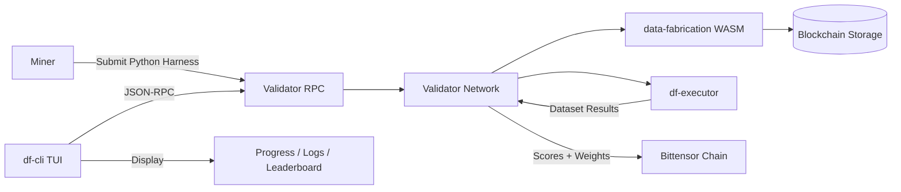
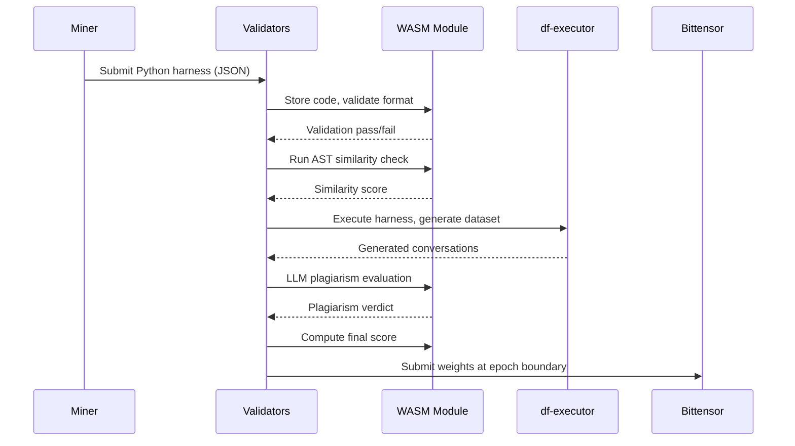
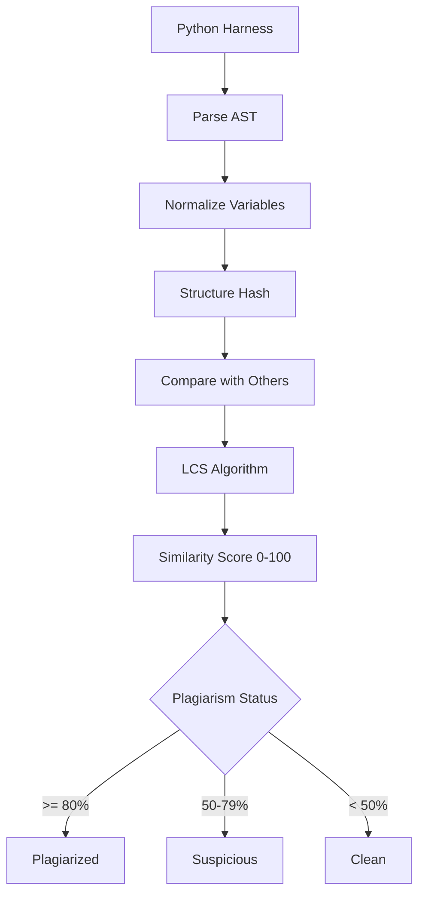

<div align="center">

# data-fabrication

**Conversation Dataset Generator — WASM Evaluation Module for Platform-v2**

[](https://github.com/PlatformNetwork/data-fabrication/blob/main/LICENSE)
[](https://www.rust-lang.org/)
[](https://webassembly.org/)

</div>

Data Fabrication is a WASM evaluation module for generating and validating AI training datasets on the Bittensor network. It runs inside [platform-v2](https://github.com/PlatformNetwork/platform-v2) validators to evaluate miner submissions that produce conversation datasets. Miners submit Python harnesses that generate synthetic conversations, and the network scores them through a multi-stage pipeline including AST structural similarity checks and LLM-based plagiarism detection.

---

## TL;DR

```bash
# Build WASM module
cargo build --target wasm32-unknown-unknown -p data-fabrication-wasm

# Build CLI tool
cargo build --release -p df-cli

# Run the TUI monitor
df-cli monitor
```

---

## System Architecture



---

## Evaluation Pipeline



---

## Similarity Detection Flow



---

## Features

- **WASM Module**: Compiles to `wasm32-unknown-unknown`, loaded by platform-v2 validators
- **AST Structural Similarity**: Normalizes Python code and compares structure via LCS algorithm
- **LLM Plagiarism Detection**: Retry-enabled LLM inference for semantic comparison
- **Submission Validation**: Size limits, format checks, and signature verification
- **Conversation Dataset Generation**: Python harnesses produce JSONL conversation datasets
- **Resource Limits**: CPU time, memory, and file size constraints for sandboxed execution
- **Plagiarism Clustering**: Groups similar submissions by structure hash prefix
- **CLI (df-cli)**: Native TUI for monitoring evaluations and network status

---

## Installation

```bash
# Via Platform CLI (recommended)
platform download data-fabrication

# Or build from source
git clone https://github.com/PlatformNetwork/data-fabrication
cd data-fabrication
cargo build --release
```

---

## Building

```bash
# Build WASM module (for platform-v2 validators)
cargo build --target wasm32-unknown-unknown -p data-fabrication-wasm

# The output .wasm file is at:
# target/wasm32-unknown-unknown/release/data_fabrication_wasm.wasm

# Build CLI (native)
cargo build --release -p df-cli

# Build executor
cargo build --release -p df-executor

# Build all workspace members
cargo build --release --workspace
```

---

## Usage

```bash
# Launch interactive TUI (connects to https://chain.platform.network)
df-cli monitor

# Submit a Python harness
df-cli submit --harness ./my-harness/

# Check submission status
df-cli status --hotkey 5Abc...

# Monitor a specific miner
df-cli --hotkey 5GrwvaEF... monitor

# Custom RPC endpoint
df-cli --rpc-url http://localhost:8080 monitor
```

**Subcommands:** `submit` · `status` · `monitor` (default)

**TUI Controls:** `Tab`/`Shift+Tab` switch tabs · `↑`/`↓` scroll · `r` refresh · `q` quit

---

## Architecture

```
data-fabrication/
├── wasm/                   # WASM evaluation module (compiled to wasm32-unknown-unknown)
│   └── src/
│       ├── lib.rs              # Challenge trait implementation
│       └── types.rs            # Submission and config types
├── core/                   # Shared types (no_std compatible)
│   └── src/
│       ├── lib.rs              # Domain types (HarnessSubmission, GeneratedDataset)
│       ├── ast_similarity.rs   # AST normalization, structure hashing, LCS comparison
│       ├── ast_validation.rs   # Python code security validation
│       ├── scoring_types.rs    # Score types (ConversationScore, DatasetScore)
│       ├── schema.rs           # JSONL parsing for conversation datasets
│       ├── consensus.rs        # Multi-validator consensus
│       ├── cache.rs            # Evaluation result caching
│       └── resource_limits.rs  # CPU, memory, file constraints
├── executor/               # Native execution engine
│   └── src/
│       ├── lib.rs              # Executor entry point
│       └── llm_inference.rs    # LLM client with retry logic
├── cli/                    # Native TUI monitoring tool
│   └── src/
│       ├── main.rs             # Entry point, event loop
│       ├── app.rs              # Application state
│       ├── ui.rs               # Ratatui UI rendering
│       └── rpc.rs              # JSON-RPC 2.0 client
├── server/                 # Native HTTP server
│   └── src/
│       └── main.rs             # HTTP evaluation server
└── src/                    # Root crate library
    └── lib.rs                  # HuggingFace dataset handler
```

---

## How It Works

1. Miners submit Python harness code via `df-cli submit`
2. Platform-v2 validators load this WASM module
3. WASM validates submission format, size limits, and signature
4. Executor runs the Python harness in a sandboxed environment
5. Generated conversations are parsed from JSONL output
6. AST similarity compares submission structure against others using normalized variables and LCS algorithm
7. LLM inference performs semantic plagiarism detection with retry logic
8. Final score combines dataset quality and originality metrics
9. Validators submit weights to Bittensor at epoch boundaries

---

## AST Similarity System

The plagiarism detection uses a two-pass approach:

### Pass 1: Structural Comparison
```python
# Original code
x = 1
y = x + 2

# After normalization (both produce identical AST)
a = 1
b = a + 2
```

Variables are normalized to `var_0`, `var_1`, etc., and the AST structure is hashed. Submissions with matching structure hashes are clustered for detailed comparison.

### Pass 2: LLM Semantic Analysis
For submissions above a similarity threshold, an LLM evaluates:
- Logic flow patterns
- Naming convention similarities
- Comment and docstring patterns

---

## Documentation

- [Architecture Overview](docs/architecture.md) — System components, host functions, storage schema
- [Miner Quickstart](docs/miner/quickstart.md) — How to build and submit harnesses
- [Executor Setup](docs/miner/executor-setup.md) — Deploy your evaluation node
- [Evaluation Pipeline](docs/miner/evaluation-pipeline.md) — Scoring and plagiarism detection
- [API Reference](docs/miner/api-reference.md) — Public and authenticated endpoints
- [Validator Setup](docs/validator/setup.md) — Hardware requirements and configuration

---

## License

Apache-2.0
