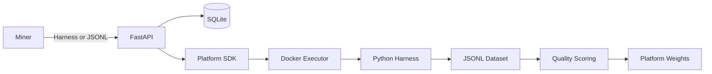
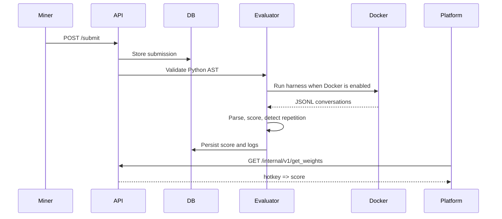
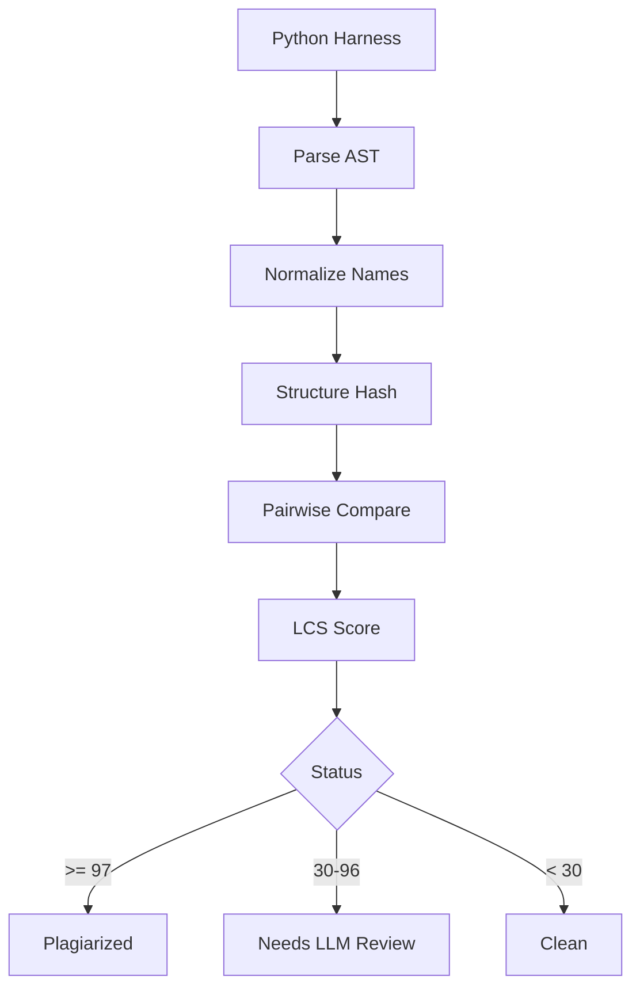

<div align="center">

# data-fabrication

**Conversation Dataset Generator — Python Platform SDK Challenge Service**

[](https://github.com/PlatformNetwork/data-fabrication/blob/main/LICENSE)
[](https://www.python.org/)
[](https://fastapi.tiangolo.com/)
[](https://github.com/PlatformNetwork/platform)


</div>

Data Fabrication is a Python challenge service for the Platform network. Miners submit Python harnesses or direct JSONL conversation datasets, the service validates and scores the generated conversations, detects structural plagiarism signals, stores results in SQLite, and exposes Platform-compatible weights.

---

## TL;DR

```bash
git clone https://github.com/PlatformNetwork/data-fabrication
cd data-fabrication
python -m venv .venv
.venv/bin/python -m pip install -e ".[dev]"
.venv/bin/pytest
```

Run locally:

```bash
DATA_FABRICATION_SHARED_TOKEN=dev-secret \
DATA_FABRICATION_DATABASE_URL=sqlite+aiosqlite:///./data-fabrication.sqlite3 \
.venv/bin/uvicorn data_fabrication.app:app --host 0.0.0.0 --port 8080
```

---

## System Architecture


```mermaid
flowchart LR
    Miner[Miner] -->|Harness or JSONL| API[FastAPI]
    API --> DB[(SQLite)]
    API --> SDK[Platform SDK]
    SDK --> Docker[Docker Executor]
    Docker --> Harness[Python Harness]
    Harness --> Dataset[JSONL Dataset]
    Dataset --> Score[Quality Scoring]
    Score --> Weights[Platform Weights]
```

---

## Evaluation Pipeline


```mermaid
sequenceDiagram
    participant M as Miner
    participant A as API
    participant D as DB
    participant E as Evaluator
    participant X as Docker
    participant P as Platform

    M->>A: POST /submit
    A->>D: Store submission
    A->>E: Validate Python AST
    E->>X: Run harness when Docker is enabled
    X-->>E: JSONL conversations
    E->>E: Parse, score, detect repetition
    E->>D: Persist score and logs
    P->>A: GET /internal/v1/get_weights
    A-->>P: hotkey => score
```

---

## Similarity Detection Flow


```mermaid
flowchart TB
    Code[Python Harness] --> Parse[Parse AST]
    Parse --> Normalize[Normalize Names]
    Normalize --> Hash[Structure Hash]
    Hash --> Compare[Pairwise Compare]
    Compare --> LCS[LCS Score]
    LCS --> Status{Status}
    Status -->|>= 97| Plagiarized[Plagiarized]
    Status -->|30-96| Review[Needs LLM Review]
    Status -->|< 30| Clean[Clean]
```

---

## Features

- **Python Platform Challenge**: FastAPI service compatible with Platform proxy and master collection.
- **Platform SDK Routes**: `/health`, `/version`, and `/internal/v1/get_weights`.
- **Secure Execution Path**: Vendored Platform Docker executor with CLI and broker backends.
- **Conversation JSONL Validation**: Enforces message schema, role flow, and minimum turns.
- **Quality Scoring**: Combines format, semantic-shape heuristics, diversity, and originality.
- **AST Safety Checks**: Blocks critical Python calls such as `exec`, `eval`, `__import__`, and `os.system`.
- **AST Similarity**: Normalizes variable names and compares structure with LCS scoring.
- **SQLite Persistence**: Stores submissions, metrics, logs, errors, and leaderboard state.
- **Optional LLM Audit**: Retry-enabled HTTP client for semantic plagiarism review.

---

## Installation

```bash
python -m venv .venv
source .venv/bin/activate
python -m pip install -e ".[dev]"
```

---

## Usage

Submit direct JSONL:

```bash
curl -X POST http://localhost:8080/submit \
  -H "content-type: application/json" \
  -d '{
    "hotkey": "5Abc...",
    "dataset_jsonl": "{\"messages\":[{\"role\":\"user\",\"content\":\"Explain gravity.\"},{\"role\":\"assistant\",\"content\":\"Gravity is the attraction between masses.\"}]}"
  }'
```

Submit a Python harness:

```bash
curl -X POST http://localhost:8080/submit \
  -H "content-type: application/json" \
  -d '{
    "hotkey": "5Abc...",
    "filename": "harness.py",
    "code": "import json\nprint(json.dumps({\"messages\":[{\"role\":\"user\",\"content\":\"Give a detailed math prompt.\"},{\"role\":\"assistant\",\"content\":\"Here is a detailed synthetic answer with enough content for scoring.\"}]}))"
  }'
```

Read results:

```bash
curl http://localhost:8080/leaderboard
curl http://localhost:8080/status
curl http://localhost:8080/submissions
curl http://localhost:8080/internal/v1/get_weights \
  -H "authorization: Bearer dev-secret" \
  -H "x-platform-challenge-slug: data-fabrication"
```

**Public routes:** `/submit` · `/v1/submissions` · `/submissions` · `/leaderboard` · `/status` · `/stats` · `/dataset` · `/dataset/consensus` · `/agent/:hotkey` · `/results/:id`

---

## Building

```bash
# Lint
ruff check src tests

# Format check
ruff format --check src tests

# Type check
mypy --config-file pyproject.toml src

# Tests
pytest tests

# Docker image
docker build -t data-fabrication .
```

---

## Architecture

```text
data-fabrication/
├── src/data_fabrication/
│   ├── app.py                  # FastAPI entrypoint and internal bridge route
│   ├── config.py               # Runtime settings
│   ├── db.py                   # Async SQLite wrapper
│   ├── models.py               # Pydantic API schemas
│   ├── repository.py           # Persistence and leaderboard queries
│   ├── routes.py               # Public Platform routes
│   ├── weights.py              # Platform weight computation
│   ├── evaluator/
│   │   ├── ast_similarity.py   # AST normalization, hashing, LCS comparison
│   │   ├── ast_validation.py   # Python safety checks
│   │   ├── dataset.py          # JSONL parsing and schema validation
│   │   ├── execution.py        # Harness execution and evaluation orchestration
│   │   ├── llm.py              # Optional LLM plagiarism audit client
│   │   └── scoring.py          # Dataset scoring
│   └── sdk/                    # Platform-compatible app/auth/Docker helpers
├── tests/                      # Unit and API tests
├── config.example.yaml
├── Dockerfile
└── README.md
```

---

## How It Works

1. Miners submit a Python harness or a JSONL dataset.
2. The service validates size, hotkey, and payload shape.
3. Python harnesses are AST-checked before execution.
4. Production execution uses the Platform Docker executor or broker.
5. Harness output is parsed as conversation JSONL.
6. The evaluator scores format, content quality, diversity, and originality.
7. AST similarity utilities detect copy-style harness submissions.
8. SQLite stores the full evaluation record.
9. Platform reads `/internal/v1/get_weights` and receives best score per hotkey.

---

## Scoring

Final score:

```text
score = format * 0.2 + quality * 0.4 + originality * 0.4
```

Datasets pass when the final score is at least `0.5`. Scores are already normalized to `[0, 1]`, so Platform weights can directly use each miner’s best completed score.

---

## License

Apache-2.0
