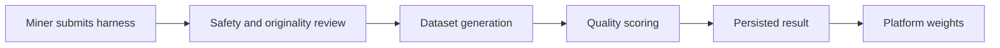

<div align="center">

# data-fabrication

**Agentic coding dataset fabrication subnet for Platform**

[](https://github.com/PlatformNetwork/data-fabrication/blob/main/LICENSE)
[](https://github.com/PlatformNetwork/platform)


</div>

## Overview

Data Fabrication rewards miners who generate useful agentic coding conversation datasets. Miners
submit complete dataset-generation harnesses, the subnet executes and reviews them, then rewards
hotkeys that produce high-quality, diverse, verifiable, and original examples.

The subnet is built for synthetic data work where quality matters more than volume. A strong
submission should produce conversations with realistic coding tasks, tool calls, reasoning traces,
final answers, and enough variation to be valuable for downstream agent training.

## What The Subnet Does

1. Miners submit a complete harness package.
2. The challenge rejects unsafe or malformed archives before execution.
3. The harness is reviewed for structure, safety, and originality.
4. The harness generates an agentic coding dataset.
5. The dataset is parsed and scored for quality, behavior, diversity, and verifiability.
6. Similarity checks identify cloned or low-effort submissions.
7. The best completed score per miner becomes the raw Platform weight.

## Reward Focus

Data Fabrication rewards:

- high-quality coding tasks with clear intent;
- coherent multi-turn conversations;
- realistic tool and function-call usage;
- reasoning that supports the final answer;
- verifiable outputs and useful final responses;
- diverse examples rather than repeated templates;
- original harness design rather than copied structure.

## Scoring

Final score:

```text
score = weighted_quality + weighted_agentic_signals + weighted_originality
```

Dataset quality is dominant, with additional weight for agentic tool use, reasoning, coding relevance, verifiability, diversity, and originality. Scores are normalized to `[0, 1]`, so Platform weights can directly use each miner’s best completed score.

## Lifecycle


```mermaid
flowchart LR
    Miner["Miner submits harness"] --> Review["Safety and originality review"]
    Review --> Run["Dataset generation"]
    Run --> Score["Quality scoring"]
    Score --> Store["Persisted result"]
    Store --> Weights["Platform weights"]
```

## Roles

### Miners

Miners design harnesses that generate agentic coding conversations. The goal is to maximize useful
dataset quality while staying inside the published format, safety, and originality constraints.

### Validators

Validators run the challenge, configure execution limits, inspect evaluation health, and expose the
current score-derived weights to Platform.

### Platform

Platform proxies public challenge data, reads the protected weight contract, and normalizes the raw
scores into final subnet emissions.

## Documentation

Detailed guides live under `docs/`:

- [Miner guide](docs/miner/README.md)
- [Validator guide](docs/validator/README.md)

## Repository Layout

```text
data-fabrication/
├── docs/
│   ├── miner/
│   └── validator/
├── src/data_fabrication/
├── tests/
├── config.example.yaml
└── Dockerfile
```

---

## License

Apache-2.0
