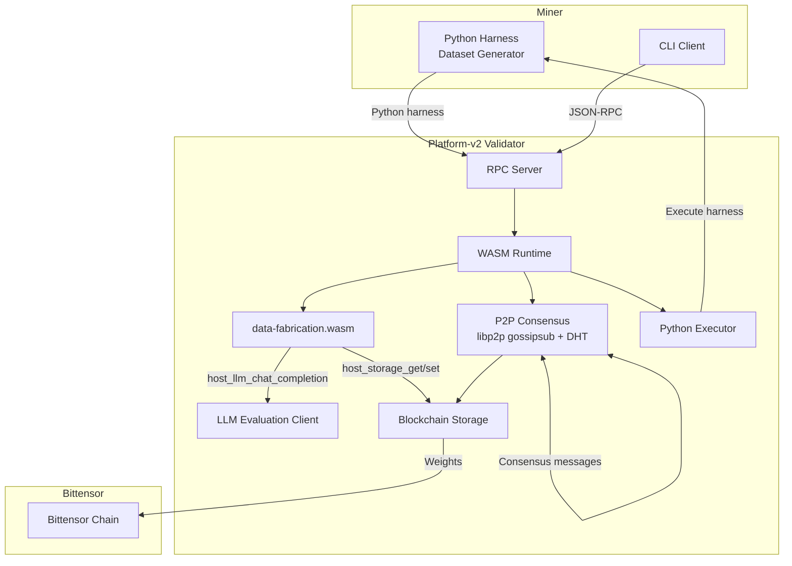
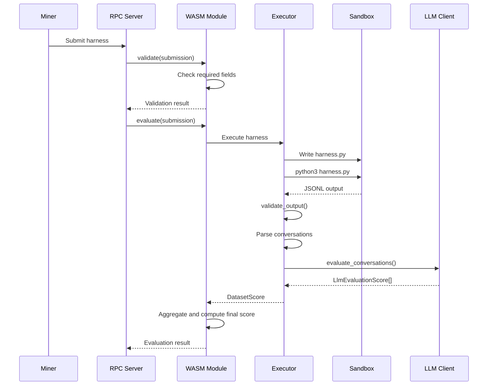
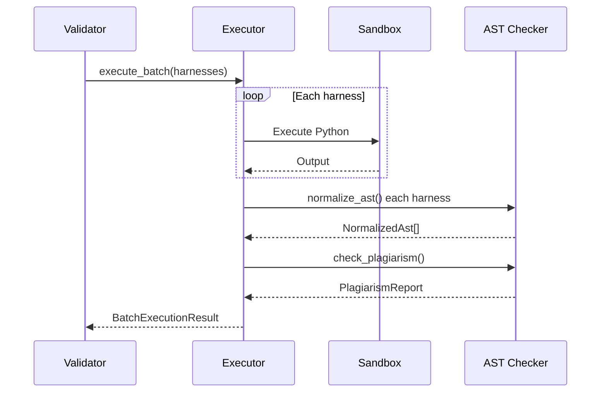

# Architecture Overview

This document describes the internal architecture of Data Fabrication, including system components, the WASM module design, host function surface, and storage schema.

---

## System Components



---

## WASM Module Architecture

```mermaid
flowchart TB
    subgraph "data-fabrication-wasm (no_std)"
        Lib[lib.rs<br/>Challenge trait impl]
        Types[types.rs<br/>Submission, ChallengeParams,<br/>EvaluationResult]
    end

    Lib --> Types

    subgraph "Host Functions (platform)"
        HStorage[host_storage_get/set]
        HLlm[host_llm_chat_completion]
        HLlmAvail[host_llm_is_available]
        HEpoch[host_consensus_get_epoch]
    end

    Lib --> HStorage
    Lib --> HLlm
    Lib --> HLlmAvail
    Lib --> HEpoch

    subgraph "data-fabrication-core (std)"
        CoreLib[lib.rs<br/>Domain types]
        AstSimilarity[ast_similarity.rs<br/>Plagiarism detection]
        LlmClient[llm_client.rs<br/>LLM client trait]
        ScoringTypes[scoring_types.rs<br/>Score types]
        Schema[schema.rs<br/>JSONL parsing]
        Config[config.rs<br/>Configuration]
        Sandbox[sandbox.rs<br/>Execution sandbox]
        AstValidation[ast_validation.rs<br/>Code security]
        ResourceLimits[resource_limits.rs<br/>Resource constraints]
        Consensus[consensus.rs<br/>Consensus helpers]
        Cache[cache.rs<br/>Evaluation cache]
    end

    Lib --> CoreLib
    CoreLib --> AstSimilarity
    CoreLib --> LlmClient
    CoreLib --> ScoringTypes
    CoreLib --> Schema
    CoreLib --> Config
    CoreLib --> Sandbox
    CoreLib --> AstValidation
    CoreLib --> ResourceLimits
    CoreLib --> Consensus
    CoreLib --> Cache

    subgraph "data-fabrication-executor (std)"
        ExecutorRs[executor.rs<br/>Python execution]
        LlmInference[llm_inference.rs<br/>LLM retry logic]
    end

    Exec --> ExecutorRs
    ExecutorRs --> LlmInference
```



### Module Responsibilities

| Module | Purpose |
| --- | --- |
| `wasm/lib.rs` | Implements the `Challenge` trait: `validate()`, `evaluate()`, `routes()`, `handle_route()` |
| `wasm/types.rs` | WASM-specific types: `Submission`, `ChallengeParams`, `EvaluationResult` |
| `core/lib.rs` | Domain types: `HarnessSubmission`, `GeneratedDataset`, `ConversationEntry`, `Message` |
| `core/ast_similarity.rs` | AST structural comparison, plagiarism detection, similarity scoring |
| `core/llm_client.rs` | LLM client trait, HTTP client, WASM client, mock client for testing |
| `core/scoring_types.rs` | Multi-criteria scoring: `CriteriaScores`, `LlmEvaluationScore`, `DatasetScore` |
| `core/schema.rs` | JSONL parsing and validation for conversation datasets |
| `core/config.rs` | Configuration types: `HarnessExecutionConfig`, `EvaluationConfig`, constants |
| `core/sandbox.rs` | Temporary directory sandbox for harness execution |
| `core/ast_validation.rs` | Python AST validation, security violation detection |
| `core/resource_limits.rs` | Unix resource limits for sandboxed execution |
| `core/consensus.rs` | Consensus result types for distributed evaluation |
| `core/cache.rs` | Evaluation result caching with TTL |
| `executor/executor.rs` | Python harness execution engine, batch execution, similarity checking |
| `executor/llm_inference.rs` | LLM inference with retry and error handling |

---

## Host Function Surface

These are the host functions available to WASM challenge modules, provided by `platform-challenge-sdk-wasm`. Data Fabrication uses a subset of these.

### Storage Functions (`platform_storage`)

| Function | Signature | Description | Used |
| --- | --- | --- | --- |
| `host_storage_get` | `(key: &[u8]) -> Result<Vec<u8>, i32>` | Read from blockchain storage | Yes |
| `host_storage_set` | `(key: &[u8], value: &[u8]) -> Result<(), i32>` | Write to blockchain storage | Yes |

### LLM Functions (`platform_llm`)

| Function | Signature | Description | Used |
| --- | --- | --- | --- |
| `host_llm_chat_completion` | `(request: &[u8]) -> Result<Vec<u8>, i32>` | LLM chat completion | Yes |
| `host_llm_is_available` | `() -> bool` | Check LLM availability | Yes |

### Consensus Functions (`platform_consensus`)

| Function | Signature | Description | Used |
| --- | --- | --- | --- |
| `host_consensus_get_epoch` | `() -> i64` | Get current epoch number | Yes |

### Terminal Functions (`platform_terminal`)

| Function | Signature | Description | Used |
| --- | --- | --- | --- |
| `host_get_time` | `() -> i64` | Get current timestamp | No |
| `host_random_seed` | `(buf: &mut [u8]) -> Result<(), i32>` | Fill buffer with random bytes | No |

---

## WASM ABI Exports

The `register_challenge!` macro exports these functions from the WASM module:

| Export | Signature | Description |
| --- | --- | --- |
| `evaluate` | `(agent_ptr: i32, agent_len: i32) -> i64` | Evaluate a submission, returns packed ptr+len |
| `validate` | `(agent_ptr: i32, agent_len: i32) -> i32` | Validate a submission, returns 0 or 1 |
| `get_name` | `() -> i32` | Return challenge name |
| `get_version` | `() -> i32` | Return challenge version |
| `get_routes` | `() -> i64` | Return route definitions |
| `handle_route` | `(req_ptr: i32, req_len: i32) -> i64` | Handle an incoming route request |
| `alloc` | `(size: usize) -> *mut u8` | Allocate memory in WASM linear memory |

---

## Core vs Executor Relationship

Data Fabrication uses a dual-component architecture:

### Core Library (`data-fabrication-core`)

The core library provides all domain types, validation logic, and utility functions. It is designed to be usable in both WASM (`no_std`) and server (`std`) environments.

Key responsibilities:
- **Domain Types**: `HarnessSubmission`, `GeneratedDataset`, `ConversationEntry`
- **JSONL Parsing**: `JsonlParser` validates conversation dataset format
- **AST Similarity**: `normalize_ast()`, `compare_structures()`, `check_plagiarism()`
- **Scoring Types**: Multi-criteria evaluation with `CriteriaScores` and `DatasetScore`
- **LLM Client Trait**: Abstract interface for LLM evaluation (`HttpLlmClient`, `WasmLlmClient`, `MockLlmClient`)
- **Configuration**: `HarnessExecutionConfig` and `EvaluationConfig` with validation
- **Sandbox**: Temporary directory isolation for harness execution
- **Security**: Python AST validation with severity-based blocking

### Executor Binary (`data-fabrication-executor`)

The executor is a server component that runs Python harnesses and coordinates LLM evaluation.

Key responsibilities:
- **Python Execution**: `PythonExecutor` runs harnesses with timeouts and output limits
- **Batch Processing**: `execute_batch()` runs multiple harnesses with similarity checking
- **Security Enforcement**: Blocks execution on critical security violations (e.g., `exec()`, `eval()`, `os.system()`)
- **LLM Integration**: Calls LLM APIs for semantic evaluation with retry logic

### Separation Benefits

1. **WASM Compatibility**: Core types can be compiled to WASM for on-chain validation
2. **Testing**: Mock clients and isolated types enable unit testing
3. **Flexibility**: Different executors can be swapped without changing core logic
4. **Security**: Core validation runs before any execution

---

## Storage Key Schema

Data Fabrication uses the following storage keys via `host_storage_get` and `host_storage_set`:

### Submission Storage Keys

| Key Format | Content | Max Size | Module |
| --- | --- | --- | --- |
| `submission:<hotkey_str>:<epoch_le>` | Serialized `Submission` | 4 MB | `wasm/lib` |
| `submission_hash:<hotkey_str>:<epoch_le>` | SHA-256 hash of package | 64 bytes | `wasm/lib` |

### Score Storage Keys

| Key Format | Content | Size | Module |
| --- | --- | --- | --- |
| `score:<hotkey_str>` | Score value (f64 LE) | 8 bytes | `wasm/lib` |
| `score:<hotkey_str>:<epoch_le>` | Per-epoch score (f64 LE) | 8 bytes | `wasm/lib` |

### Plagiarism Detection Keys

| Key Format | Content | Size | Module |
| --- | --- | --- | --- |
| `similarity:<hash_prefix>` | Serialized `Vec<(usize, usize, u8)>` scores | Variable | `executor` |
| `plagiarism_report:<epoch_le>` | Serialized `PlagiarismReport` | Variable | `executor` |

### Dataset Storage Keys

| Key Format | Content | Size | Module |
| --- | --- | --- | --- |
| `dataset:<hotkey_str>:<epoch_le>` | Serialized `GeneratedDataset` | 100 MB max | `core` |

### Configuration Keys

| Key Format | Content | Size | Module |
| --- | --- | --- | --- |
| `eval_config` | Serialized `EvaluationConfig` | Variable | `wasm/lib` |
| `harness_config` | Serialized `HarnessExecutionConfig` | Variable | `executor` |

### Key Encoding

- **Hotkey**: String representation of miner's hotkey
- **Epoch**: Little-endian encoded `u64` (`epoch.to_le_bytes()`)
- **Separator**: ASCII colon (`:`, byte `0x3A`)

---

## Data Types

### Core Submission Types

```
Submission {
    hotkey: String,
    epoch: u64,
    code_hash: String,
    package: Vec<u8>,
    signature: String,
}

HarnessSubmission {
    hotkey: String,
    epoch: u64,
    code_hash: String,
    package: Vec<u8>,
}

GeneratedDataset {
    conversations: Vec<ConversationEntry>,
    metadata: DatasetMetadata,
    generation_time_ms: u64,
}
```

### Conversation Types

```
ConversationEntry {
    messages: Vec<Message>,
    function_calls: Option<Vec<FunctionCall>>,
    thinking: Option<String>,
}

Message {
    role: String,
    content: String,
    name: Option<String>,
    function_call: Option<FunctionCall>,
}

FunctionCall {
    name: String,
    arguments: String,
}

DatasetMetadata {
    conversation_count: u64,
    total_messages: u64,
    size_bytes: u64,
    model: Option<String>,
    generation_params: Option<GenerationParams>,
}
```

### Configuration Types

```
ChallengeParams {
    min_conversations: u32,     // default: 10
    max_conversations: u32,     // default: 50
    max_size_bytes: u64,        // default: 104_857_600 (100 MB)
    model: Option<String>,
}

HarnessExecutionConfig {
    seed: u64,                  // for reproducibility
    conversation_count: u32,    // 10-50
    timeout_seconds: u64,       // max 7200 (2 hours)
    max_dataset_size_bytes: u64,// max 100 MB
    memory_limit_bytes: u64,    // default 2 GB
}

EvaluationConfig {
    llm_model: String,          // default: "claude-3-sonnet"
    llm_endpoint: String,       // default: "https://chutes.ai/v1"
    max_retries: u32,           // default: 3
    retry_delay_ms: u64,        // default: 1000
}
```

### Scoring Types

```
CriteriaScores {
    diversity_thematic: f64,    // topic diversity (0.0-1.0)
    diversity_structural: f64,  // format/length diversity (0.0-1.0)
    uniqueness: f64,            // avoidance of repetition (0.0-1.0)
    quality_semantic: f64,      // semantic coherence (0.0-1.0)
}

LlmEvaluationScore {
    overall: f64,               // weighted average of criteria
    criteria: CriteriaScores,
    reasoning: String,
    summary: String,
}

ConversationScore {
    conversation_id: u64,
    score: LlmEvaluationScore,
}

DatasetScore {
    scores: Vec<ConversationScore>,
    aggregated: f64,            // average of all conversation scores
    summary: String,
}
```

### Plagiarism Types

```
SimilarityScore(u8)             // 0-100%

PlagiarismStatus = Clean | Suspicious | Plagiarized
// Clean: < 50%
// Suspicious: 50-79%
// Plagiarized: >= 80%

ComparisonResult {
    score: SimilarityScore,
    submission_a: usize,
    submission_b: usize,
}

PlagiarismReport = NoSubmissions | InsufficientData | Results { ... } | ParseError { ... }

NormalizedAst {
    source: String,
    node_sequence: Vec<String>,
}

StructureHash([u8; 32])        // SHA-256 of AST structure

SubmissionCluster {
    hash_prefix: u64,
    submission_indices: Vec<usize>,
}
```

---

## Execution Flow

### Single Submission Evaluation



### Batch Execution with Plagiarism Check



---

## Serialization

- **WASM ↔ Host**: `bincode` with fixed-int encoding and size limits
- **JSONL Output**: `serde_json` line-delimited JSON
- **Storage Values**: `bincode` serialization
- **RPC**: JSON-RPC 2.0 over HTTP

### Size Limits

| Context | Limit | Constant |
| --- | --- | --- |
| Submission deserialization | 4 MB | `MAX_SUBMISSION_SIZE` |
| Challenge params deserialization | 1 MB | `MAX_PARAMS_SIZE` |
| Maximum output size | 10 MB | `MAX_OUTPUT_SIZE` |
| Maximum dataset size | 100 MB | `MAX_DATASET_SIZE_BYTES` |
| Maximum execution timeout | 2 hours | `MAX_TIMEOUT_SECONDS` |
| Minimum conversations | 10 | `MIN_CONVERSATION_COUNT` |
| Maximum conversations | 50 | `MAX_CONVERSATION_COUNT` |
| Default memory limit | 2 GB | `DEFAULT_MEMORY_LIMIT_BYTES` |

---

## Security Model

### AST Validation Severity Levels

| Severity | Behavior | Examples |
| --- | --- | --- |
| **Critical** | Block execution | `exec()`, `eval()`, `compile()`, `os.system()`, `subprocess.call()` with shell=True |
| **Warning** | Log warning, allow execution | `subprocess.run()`, `open()` with write modes, `__import__()` |

### Plagiarism Detection Thresholds

| Similarity Score | Status | Action |
| --- | --- | --- |
| 0-49% | Clean | Accept |
| 50-79% | Suspicious | Flag for review |
| 80-100% | Plagiarized | Reject or penalize |

### Sandbox Isolation

- Temporary working directory per execution
- No network access (unless configured)
- No file system access outside sandbox
- Resource limits enforced via Unix rlimits
- Process killed on timeout

---

## LLM Evaluation Protocol

### Criteria Weights

Each criterion in `CriteriaScores` is equally weighted at 0.25:

- **Diversity Thematic** (25%): Topic variety across conversations
- **Diversity Structural** (25%): Format and length variation
- **Uniqueness** (25%): Avoidance of repeating patterns
- **Quality Semantic** (25%): Semantic coherence and relevance

### Retry Logic

The `HttpLlmClient` implements exponential backoff:

1. Initial attempt
2. On rate limit (HTTP 429): Wait `retry_delay_ms`, double delay
3. Retry up to `max_retries` times
4. Return error if all retries exhausted

Default: 3 retries with 1000ms initial delay.

---

## Testing Strategy

### Unit Tests

- Core types in `core/src/lib.rs`, `scoring_types.rs`, `config.rs`
- AST normalization and similarity in `ast_similarity.rs`
- JSONL parsing in `schema.rs`
- LLM client parsing in `llm_client.rs`

### Integration Tests

- Python execution in `executor/src/executor.rs`
- Security violation blocking
- Timeout handling
- Batch execution with plagiarism detection

### Mock Infrastructure

- `MockLlmClient`: Returns predefined scores for testing
- `WasmLlmClient`: Stub for WASM environment testing
- `Sandbox` with configurable limits
